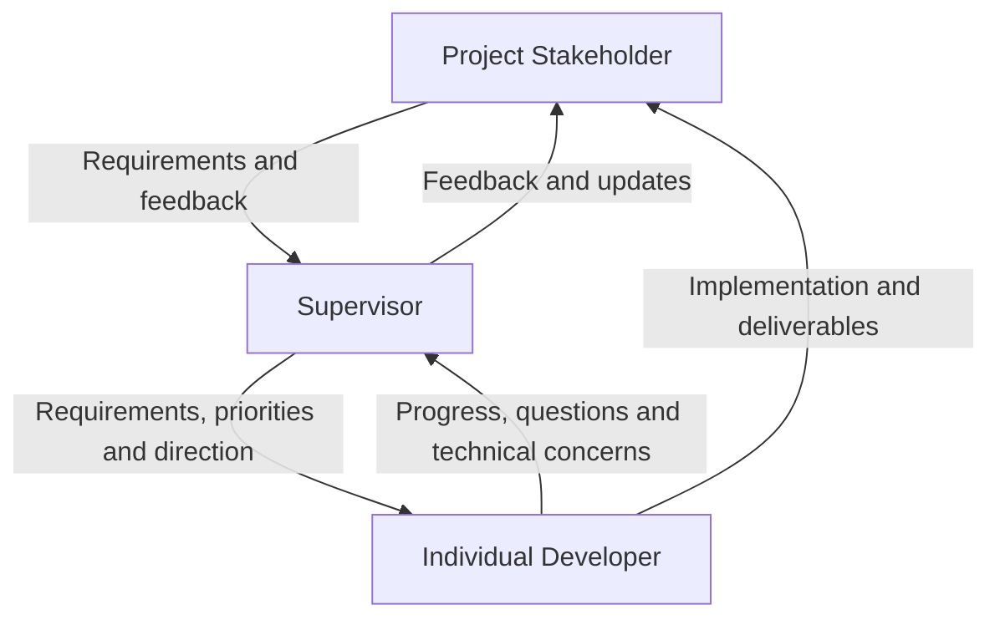

```mermaid
flowchart TD
    S["Project Stakeholder"] -->|"Requirements and feedback"| M["Supervisor"]
    M -->|"Requirements, priorities and direction"| D["Individual Developer"]
    D -->|"Progress, questions and technical concerns"| M
    M -->|"Feedback and updates"| S
    D -->|"Implementation and deliverables"| S
```