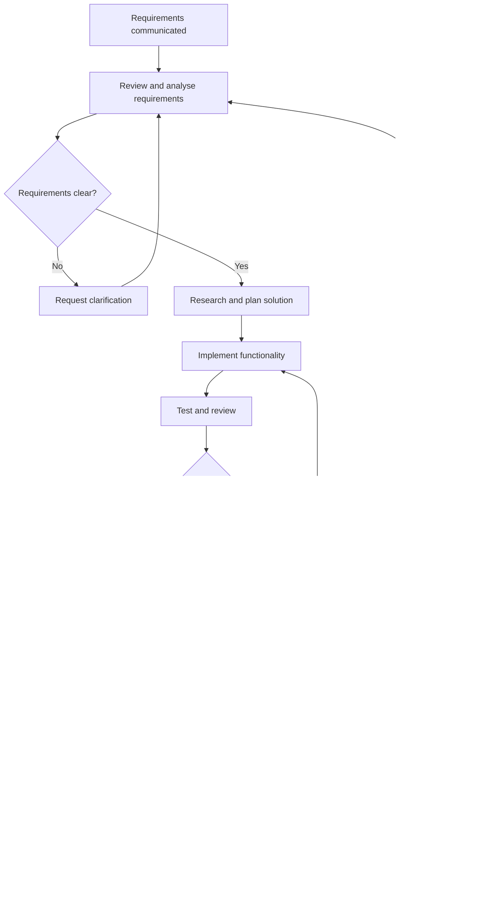

```mermaid
flowchart TD
    A["Requirements communicated"] --> B["Review and analyse requirements"]
    B --> C{"Requirements clear?"}
    C -- "No" --> D["Request clarification"]
    D --> B
    C -- "Yes" --> E["Research and plan solution"]
    E --> F["Implement functionality"]
    F --> G["Test and review"]
    G --> H{"Works as intended?"}
    H -- "No" --> I["Investigate and correct defects"]
    I --> F
    H -- "Yes" --> J{"Feedback or changes required?"}
    J -- "Yes" --> B
    J -- "No" --> K["Commit changes and make work available for review"]
    K --> L["Continue with next requirement or milestone"]
```